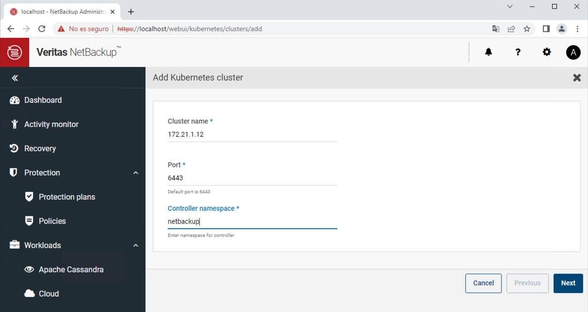
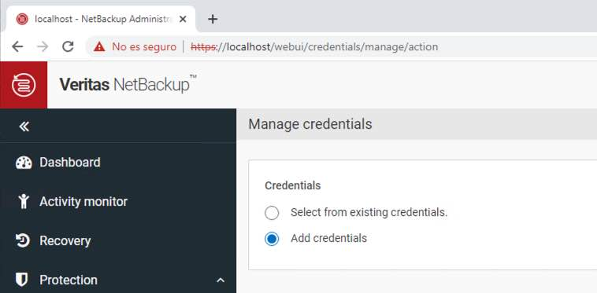
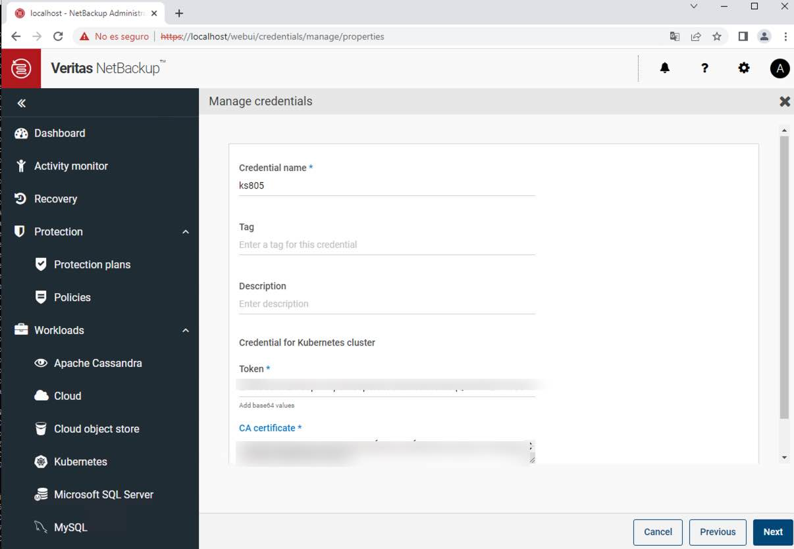
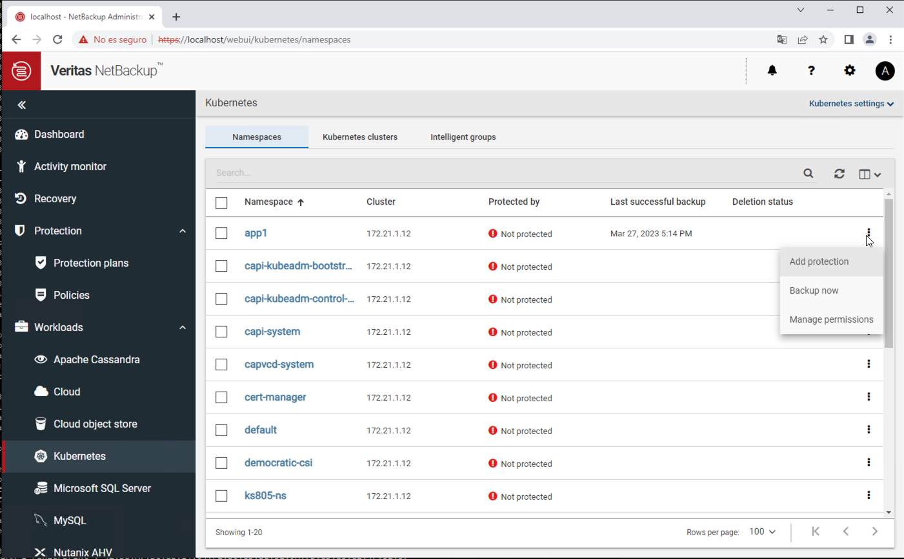

#### 1) Use helm deploy netbackupkops
```sh
oc create testvn-netbackupkops
helm install netbackupkops netbackupkops -n testvn-netbackupkops
```

#### 2) Add label to StorageClass and VolumeSnapshotClass (StorageClass:Volume binding mode need set to Immediate)
```sh
oc label sc thin-csi netbackup.veritas.com/default-csi-filesystem-storage-class=true
oc label volumesnapshotclass csi-vsphere-vsc netbackup.veritas.com/default-csi-volume-snapshot-class=true
```

#### 3) Create Tokens and Fingerprint on Veritas NetBackup server
```sh
Tokens: NetBackup Administration Console -> Security Management -> Certificate Management -> Token Management -> Create and copy token for step4
Fingerprint: C:Program Files\Veritas\NetBackup\bin\nbcertcmd.exe -listcacertdetails -> Copy SHA-256 Fingerprint for step4
```

#### 4) Create file configure for connect OpenShift to Veritas
```yml
---
apiVersion: v1
data:
  datamover.hostaliases: |
        10.252.39.25=veritas.testvn.click
  datamover.properties: |
        image=quay.testvn.click/veritas-technologies/netbackupkops:10.0.1
  version: "1"
kind: ConfigMap
metadata:
  name: veritas.testvn.click
  namespace: testvn-netbackupkops
---
apiVersion: v1
kind: Secret
metadata:
  name: datamover-secret-veritas.testvn.click
  namespace: testvn-netbackupkops
type: Opaque
stringData:
  token: ENAJJKFMBPXEAZPE (step3)
  fingerprint: C0:DD:BD:25:6E:A5:B8:7D:A5:59:26:5A:79:FF:9B:7E:B5:27:78:E5:AA:46:9A:0D:94:9E:E0:13:82:E8:BE:78 (step3)
---
apiVersion: netbackup.veritas.com/v1
kind: BackupServerCert
metadata:
  name: backupservercert-veritas.testvn.click
  namespace: testvn-netbackupkops
spec:
  clusterName: api.ocpuat.testvn.click:6443
  backupServer: veritas.testvn.click
  certificateOperation: Create
  certificateType: NBCA
  nbcaAttributes:
    nbcaCreateOptions:
      secretName: datamover-secret-veritas.testvn.click
```
#### 5) Get Tokens and Certificate on OpenShift
```sh
oc get secrets -n testvn-netbackupkops
oc get secret -n testvn-netbackupkops testvn-netbackupkops-backup-server-token-xxx -o yaml (copy ca.crt and token)
```
#### 6) Add Kubernetes Cluster on Veritas NetBackup

```sh
Cluster name: api.ocp.testvn.click
Port: 6443
Controller namespace: testvn-netbackupkops
```


```sh
Credential name: ocp-netbackupkops
Token: (step5)
CA certificate: (step5)
```
#### 7) Create a protection pland and add protection on workload kubernetes
